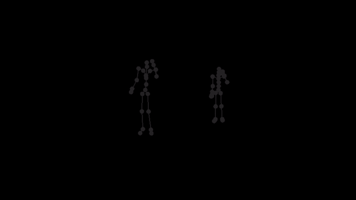
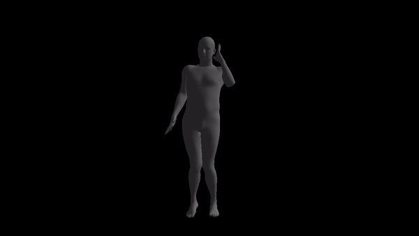

# SMPL AMC/ASF Imitator
For a given AMC/ASF motion sequence, we transfer the motion to SMPL model, and generate a corresponding SMPL sequence. The transfer method, however, is naive.

## Demo

### Skeleton (left: SMPL target, right: ASF/AMC source)

### Skinned Model

## Usage
Run `python 3Dviewer.py` to see demo.

## Challenge
The skeleton of SMPL is a little bit different from CMU MoCap Dataset's. In this implementation, we only process femur and tibia and ignore other differences. We first pose SMPL skeleton (specifically legs) to be in the same pose with ASF defination. After that, we extract rotation matrices from AMC files and apply them to the aligned SMPL model.

Feel free to [contact me](mailto:calciferzh@outlook.com) for more details.
